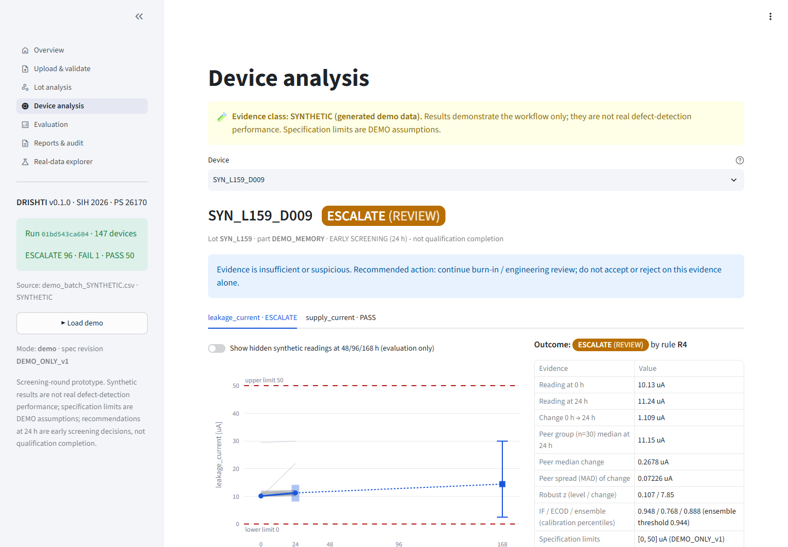

# DRISHTI — AI-driven anomaly detection for component burn-in screening

**Smart India Hackathon 2026 · Problem Statement 26170 (ISRO) · Team Agamemnon**
*AI-Driven Anomaly Detection in Component Burn-In & Screening*

> **Screening-round prototype.** It demonstrates a working, audited workflow. Synthetic results are **not**
> real defect-detection performance, shipped specification limits are **DEMO assumptions**, and 24 h
> recommendations are **early screening decisions, not qualification completion**. Production use is gated
> behind approved specifications and real validation (see [docs/MODEL_CARD.md](docs/MODEL_CARD.md)).



## What it does

| Part | What it does |
|---|---|
| **Module A — lot-relative anomalies** | Compares each device with comparable devices from its own lot (part, lot, parameter, unit, test condition) on its 24 h value and its 0→24 h change using robust median/MAD scores. Isolation Forest, ECOD and a percentile ensemble are kept as baselines. Guards for small lots, zero MAD, missing data and flagged sources. Historical lot comparison catches uniformly shifted lots. |
| **Module B — early forecast** | Predicts the 168 h value from exactly `[value_0h, value_24h]` with per part/parameter LightGBM quantile models (q05/q50/q95), calibrated on held-out lots with lot-level conformal (CQR). Persistence and linear-extrapolation baselines. Domain, unit and calibration checks escalate unsupported inputs. |
| **Decision engine** | One documented table ([docs/DECISION_TABLE.md](docs/DECISION_TABLE.md)) → **PASS / FAIL / ESCALATE** with reason codes. Observed failures and predicted violations are reported separately; an interval crossing a limit escalates; a forecast PASS never hides a peer warning. |
| **Inspector dashboard** | Streamlit + Plotly: overview, upload & validation, lot analysis, device analysis, evaluation, reports & audit, and a separate real-data explorer. One-click **Load demo**. |
| **Reports & audit** | PDF screening report, CSV/JSON export, append-only JSONL audit log with a hash chain. The chain detects accidental edits; it is **not** tamper-proof. |

## Quick start (Windows PowerShell; Linux/macOS use `.venv/bin/python`)

**Moving to a new laptop?** Follow [NEW_LAPTOP.md](docs/NEW_LAPTOP.md). The full 272 MB dataset plus 29 MB research archive are backed up as
**private release attachments**; cloning Git alone retrieves the working demo/public subset.
The PPT and original brief are in [docs/presentation/](docs/presentation/).

After cloning and signing in with `gh auth login`, this installs, restores all collected data,
verifies the demo and launches it (Python 3.11; substitute 3.12 if needed):

```powershell
py -3.11 scripts/setup_project.py --full-data --run
```

Linux/macOS: `python3.11 scripts/setup_project.py --full-data --run`.
Omit `--full-data` for the smaller working demo. No retraining is needed.

Tested with **Python 3.11.9** locally and with **3.11 and 3.12** in CI (Ubuntu). CPU only; no external APIs.

```bash
git clone https://github.com/Hopper543/DRISHTI.git
```
```bash
cd DRISHTI
```
```bash
python -m venv .venv
```
```bash
.venv\Scripts\python -m pip install -r requirements.txt
```
```bash
.venv\Scripts\python -m streamlit run app/streamlit_app.py
```

Open http://localhost:8501 and press **▶ Load demo** in the sidebar. Everything needed for the demo (synthetic
fixtures, public real subsets, trained models and calibration) is committed; no data preparation is needed.

Run the tests:

```bash
.venv\Scripts\python -m pytest
```

## Reproduce models, evaluation and sample outputs

```bash
.venv\Scripts\python scripts/train.py
```
```bash
.venv\Scripts\python scripts/evaluate.py
```
```bash
.venv\Scripts\python scripts/generate_synthetic.py --check
```
```bash
.venv\Scripts\python scripts/build_demo_fixtures.py
```
```bash
.venv\Scripts\python scripts/generate_sample_report.py
```

`train.py` fits Module A's reference (train lots → detectors; calibration lots → percentiles; validation lots →
ensemble threshold) and Module B (train lots → models; calibration lots → conformal margin). Test, shifted and
edge lots are never used for fitting. `evaluate.py` writes `evaluation_results/`. Optional: the full local real
tables (including sources without an explicit reuse statement) come from the dataset package:

```bash
.venv\Scripts\python scripts/prepare_data.py --package-dir "<path>\drishti_dataset_v1"
```

## Key results (details: [docs/EVALUATION.md](docs/EVALUATION.md))

| Evidence | Result |
|---|---|
| SYNTHETIC, Module A, ordinary test lots | Robust rule flags 100% of stable outliers and measurement faults, 25% of gradual drifts, 0–3% of delayed/step defects (invisible at 24 h by construction) with a 0.5% healthy-parameter flag rate. On the reserved validation lots it matched Isolation Forest and beat ECOD and the ensemble at equal flag rates, so it is the default rule. |
| SYNTHETIC, lot-shift check | 14/14 lot × parameter groups with planted uniform degradation flagged; 1 of 70 ordinary-test groups falsely flagged. |
| SYNTHETIC, Module B | Ordinary test: LightGBM beats persistence and linear extrapolation for every parameter (e.g. leakage MAE 1.18 µA vs 2.67 / 2.22). Whole-lot coverage 0.6–1.0 (target 0.9). Shifted lots: coverage ≈ 0.5 and linear extrapolation beats the model — these inputs are flagged out-of-domain and cannot PASS. |
| SYNTHETIC, device decisions | No device whose true 168 h value was out of spec received PASS on test, shifted or edge lots. 84 of 130 latent defects on ordinary test lots PASSed (mostly delayed/step onset after 24 h). 36% of healthy ordinary-test devices were escalated, mainly by RDS_on intervals crossing the 0.5 Ω demo limit. |
| REAL, SECOM (process data) | Preserved Isolation Forest baseline: **0 of 23** failed test examples detected (30 false alarms), reproduced exactly. ECOD under the same pre-declared protocol: also 0 of 23. Not tuned against test labels. |
| REAL, component cohorts | Exploratory only. With the default 8-peer minimum only AD648 groups get peer verdicts (all typical); AD620 gets no verdict (bias assignment unresolved). |

## Repository map

```
app/            Streamlit dashboard (views/ = pages); no analysis logic
drishti/        Core package (independent of Streamlit)
  schema.py       input contract & validation      module_a.py  lot-relative anomalies
  module_b.py     forecasting + conformal          decision.py  decision table
  pipeline.py     end-to-end run                    explain.py   evidence & wording
  report.py       PDF                               audit.py     hash-chained JSONL log
  real.py         real-data exploratory route       specs.py / units.py / provenance.py / data.py
config/         drishti.yaml (policy thresholds), spec_registry/DEMO_ONLY_v1.csv
models/         Saved Module A reference + detectors, Module B boosters, calibration, manifest (hashes)
data/demo/      SYNTHETIC fixture (project generated)        data/public/  redistributable REAL subsets + SECOM
data/fixtures/  demo batch, example upload, blank template    data/local/   git-ignored local-only data
evaluation_results/  outputs of scripts/evaluate.py          docs/  documentation, screenshots, sample report
scripts/        prepare_data, generate_synthetic, train, evaluate, build_demo_fixtures, generate_sample_report, take_screenshots, check_repo
tests/          pytest suite incl. end-to-end and dashboard (AppTest) tests
```

## Documentation

* [Architecture and data flow](docs/ARCHITECTURE.md)
* [Decision table](docs/DECISION_TABLE.md) · [Module A](docs/MODULE_A.md) · [Module B](docs/MODULE_B.md)
* [Evaluation](docs/EVALUATION.md) · [Model card and limitations](docs/MODEL_CARD.md)
* [Data sources, provenance and licensing](docs/DATA.md)
* [SIH demo script](docs/DEMO_SCRIPT.md) · [Testing and verification record](docs/TESTING.md)
* [Video narration with verified values](docs/VIDEO_SCRIPT.md) · [New laptop / full-data restore](docs/NEW_LAPTOP.md)
* Sample outputs: [PDF report](docs/sample_report/drishti_sample_report_SYNTHETIC.pdf),
  [CSV/JSON/audit](docs/sample_report/), [screenshots](docs/screenshots/)

## Data and licensing

Third-party data keeps its own terms; see [docs/DATA.md](docs/DATA.md). Only SYNTHETIC fixtures, SECOM (CC BY 4.0)
and rows from NASA reports whose NTRS records state *Public Use Permitted* are committed. Sources without an
explicit reuse statement (NDS352, AD648, capacitor #14 data, IGBT) stay local and git-ignored. No project licence
has been chosen yet; the team should select one before making the repository public.
