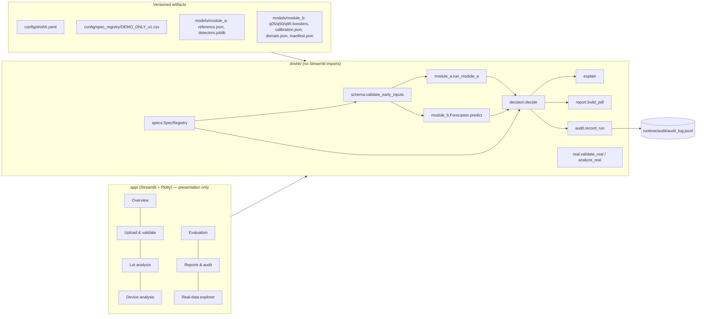
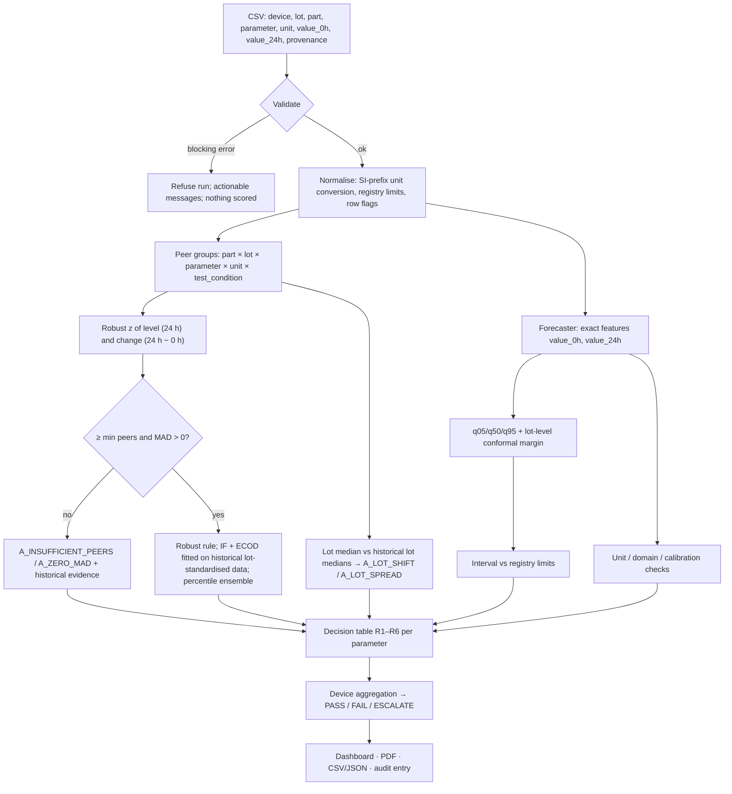
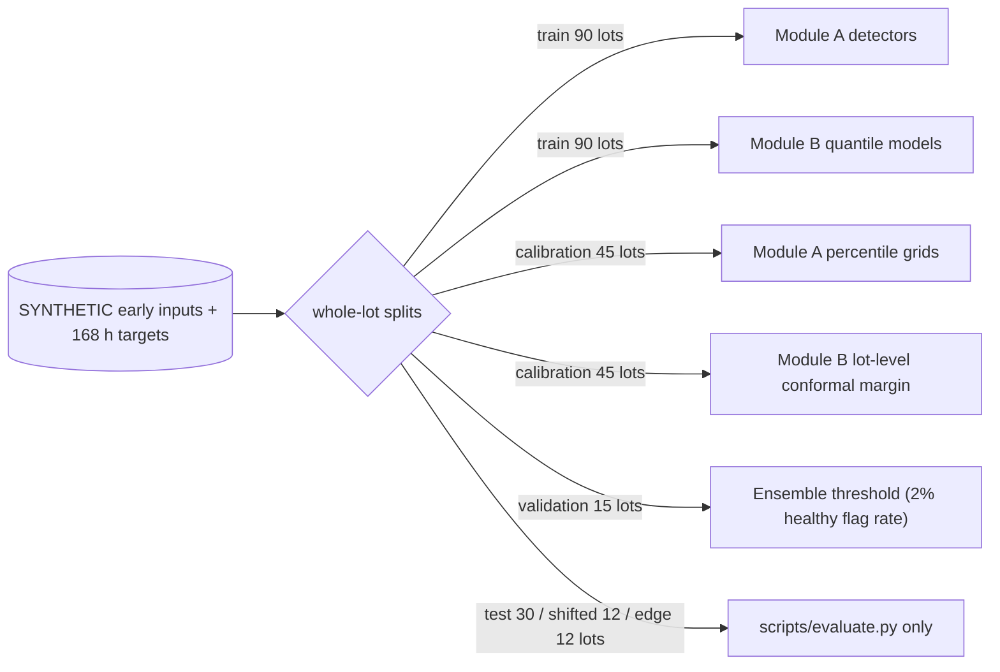

# Architecture and data flow

## Layers

`drishti.pipeline.run_screening()` is the single entry point used by the dashboard, tests, evaluation and
sample-report scripts, so the UI never re-implements analysis logic.

## Screening data flow (24 h decision)

Only readings available by 24 h enter any computation for the decision. The dashboard can reveal the hidden
48/96/168 h synthetic readings for demonstration, clearly labelled, after the decision is made.

## Training / fitting flow

Real component data and SECOM are **never** concatenated with the synthetic data or with each other. SECOM has its
own evaluation (`scripts/evaluate.py::secom`), and real component cohorts use the separate exploratory route
(`drishti/real.py`).

## Artifacts and versioning

| Artifact | Identity recorded in each run |
|---|---|
| Module B boosters, calibration, domain | SHA-256 per file in `models/module_b/manifest.json`; `model_version_hash`; load refuses mismatching files |
| Module A reference + detectors | `reference_hash` in `models/module_a/reference.json` |
| Specification registry | `revision` column + SHA-256 of the file |
| Input | SHA-256 of the uploaded bytes |
| Code | `drishti.__version__` inside the model version string |

## Runtime files

`runtime/` (git-ignored; override with `DRISHTI_RUNTIME_DIR`) holds the audit log. Nothing else is written at
run time; reports and exports are streamed to the browser.
